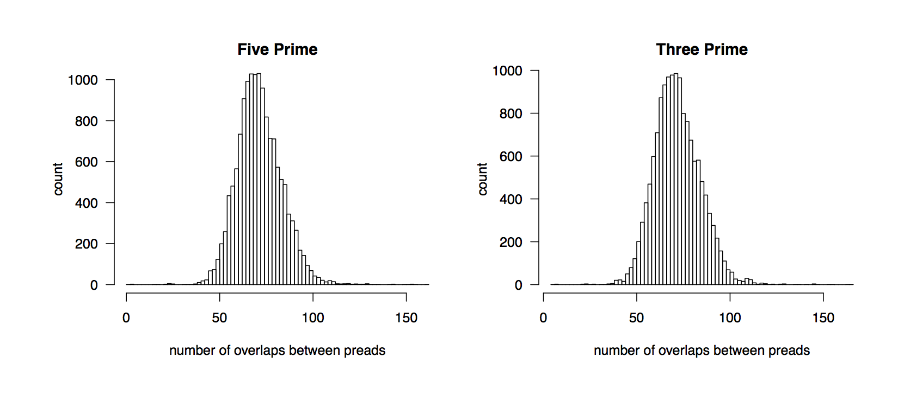

.. _OvlpHists:

Example R Code
--------------

.. code-block:: R
	
	library(ggplot2)
	o<-read.table("ovlp.stats", header=F)
	colnames(o)<-c("pread","length","fivePrimeOvlps","threePrimeOvlps")

	pdf(file="OvlpHist.pdf", width=11, height=5)
	par(oma=c(3,3,2,0), cex=1.6, las=1, mar=c(4,4,2,2), mfrow=c(1,2))
	hist(o$fivePrimeOvlps, breaks=100, 
     		xlab="number of overlaps between preads", 
     		ylab="count", main="Five Prime")
	hist(o$threePrimeOvlps, breaks=100, 
     		xlab="number of overlaps between preads", 
     		ylab="count", main="Three Prime")
	dev.off()

Example Input Files
-------------------

:download:`ovlp.stats <ovlp.stats>`
