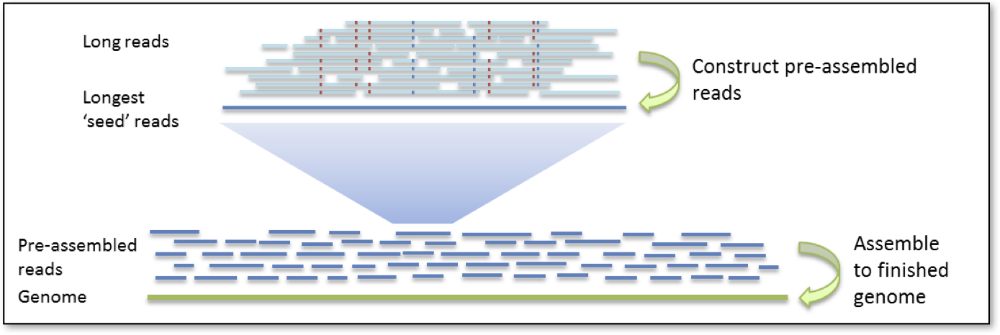
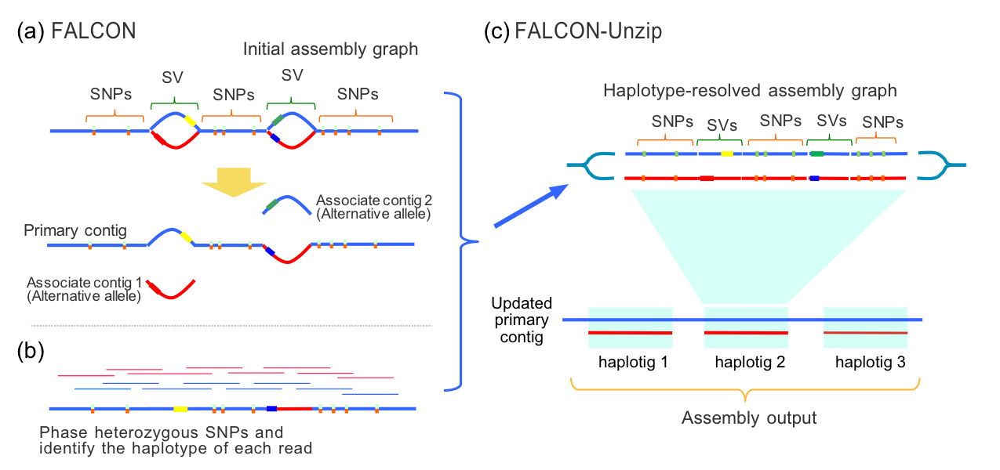
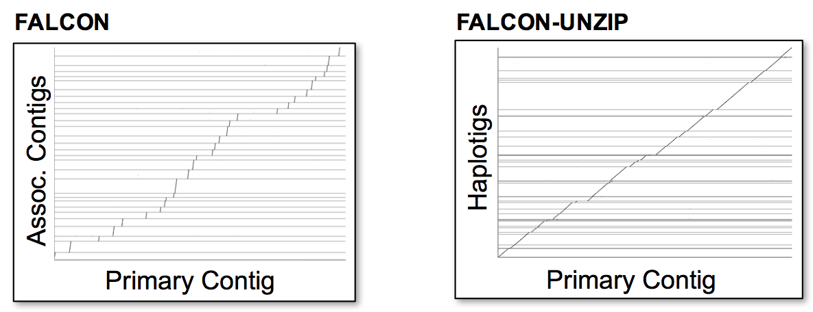

.. image:: media/falcon_icon2.png
   :height: 200px
   :width: 200 px
   :alt: FALCON Assembler
   :align: right

.. _about:

About FALCON
============

Overview
--------

``FALCON`` and ``FALCON-Unzip`` are *de novo* genome assemblers for PacBio long reads, also known as 
single-molecule real-time (SMRT) sequences. ``FALCON`` is a diploid-aware assembler 
which follows the hierarchical genome assembly process (HGAP_) and is optimized for 
large genome assembly (e.g. non-microbial). ``FALCON`` produces a set of :term:`primary contigs <primary 
contig>`(p-contigs),
which represent the backbone of the genome sequence, as well as :term:`associate contigs <associated contig>` (a-contigs),
which represent divergent allelic variants. Each a-contig is associated with a homologous
genomic region on an p-contig.

``FALCON-Unzip`` is a true diploid assembler. It takes the contigs from 
``FALCON`` and phases the reads based on heterozygous SNPs identified in the initial 
assembly. It then produces a set of partially phased :term:`primary contigs <primary contig>` and fully phased
:term:`haplotigs <haplotig>` which represent divergent haplotyes.

Detailed Description
--------------------

### HGAP

The hierarchical genome assembly process proceeds in two rounds. The first round of assembly involves the selection of seed reads, 
or the longest reads in the dataset (user-defined :ref:`length_cutoff <length_cutoff>`). All shorter reads are aligned to 
the seed reads, in 
order to generate consensus sequences with high accuracy. We refer to these as pre-assembled reads but they can also be 
thought of as 
“error corrected” reads. During the pre-assembly process, seed reads may be split or trimmed at regions of low read 
coverage (user-defined `min_cov` for :ref:`falcon_sense_option <falcon_sense_option>`). The performance of the pre-assembly 
process is captured in the `pre-assembly stats file.
<http://pb-falcon.readthedocs.io/en/latest/tutorial.html#raw-and-pread-coverage-and-quality>`_

In the next round of HGAP, the :term:`preads <pread>`, are aligned to each other and assembled into 
genomic contigs.

### FALCON

For more complex genomes assembled with ``FALCON``, 
"bubbles" in the contig-assembly graph may be resolved as associate and primary contigs. Associate contig 
IDs contain the name of their primary contig but the precise location of alignment must be determined with third party 
tools such as NUCmer_. For example, in a ``FALCON`` assembly, `000123F-010-01` is an associated contig to primary contig 
`000123F`. In a ``FALCON-Unzip`` assembly, `000123F_001` is a haplotig of primary contig `000123F`.

Below are examples of alignments between associate and primary contigs from ``FALCON``, and haplotigs and primary contigs 
from 
``FALCON-Unzip``. Alignments were built with NUCmer_ and visualized with Assemblytics_. Precise coordinates 
may be obtained with the show-coords_ utilty from MUMmer_. 

References
----------

`Chin et al. (2016). Phased diploid genome assembly with single-molecule real-time sequencing. Nature Methods. 13(12), 1050.  
<http://www.nature.com/nmeth/journal/vaop/ncurrent/full/nmeth.4035.html>`_

`Chin, et al. (2013). Nonhybrid, finished microbial genome assemblies from long-read SMRT sequencing data. Nature Methods. 10(6), 563.
<http://www.nature.com/nmeth/journal/v10/n6/full/nmeth.2474.html>`_

.. _HGAP: http://www.nature.com/nmeth/journal/v10/n6/full/nmeth.2474.html
.. _NUCmer: http://mummer.sourceforge.net/manual/#nucmer
.. _assemblytics: http://qb.cshl.edu/assemblytics/
.. _MUMmer: http://mummer.sourceforge.net/manual/
.. _show-coords: http://mummer.sourceforge.net/manual/#coords
