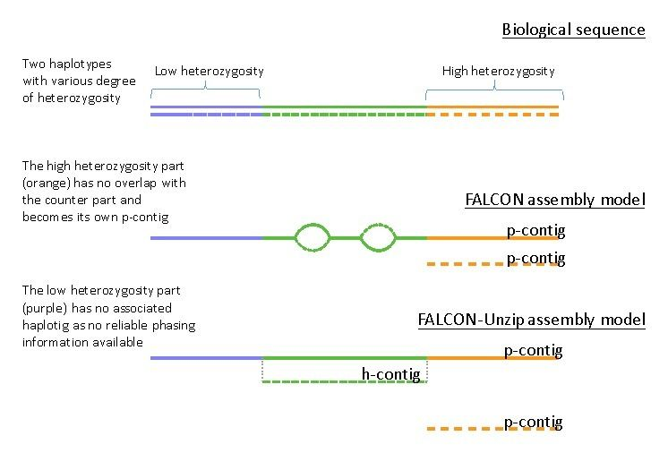
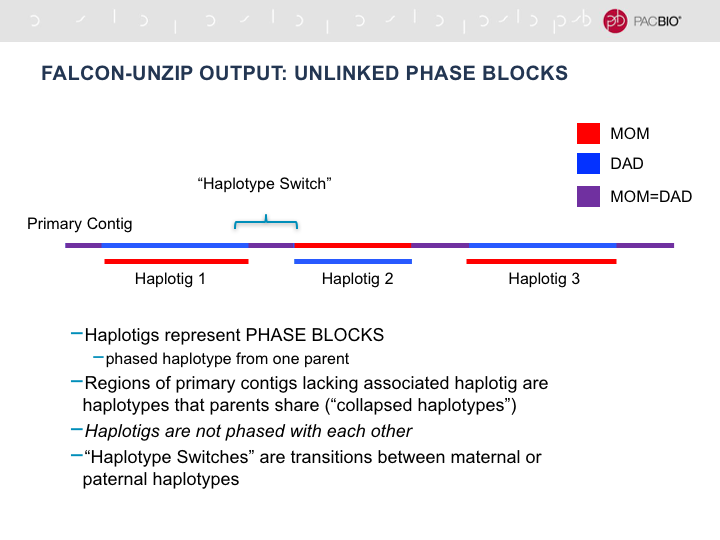

.. _faq:

Frequently Asked Questions
==========================

General
-------

Can I start from corrected reads?
~~~~~~~~~~~~~~~~~~~~~~~~~~~~~~~~~

Yes. The option :ref:`input_type <input_type>` can be set to either ``raw`` or ``preads``. In the case of the latter,
:ref:`fc_run.py` will assume the fasta files in :ref:`input_fofn <input_fofn>` are all error-corrected reads and it
will ignore any :term:`error correction` step and go directly into the final assembly overlapping step.

How do I select a length cutoff?
~~~~~~~~~~~~~~~~~~~~~~~~~~~~~~~~

The option :ref:`length_cutoff <length_cutoff>` controls the read length cutoff used during the
:term:`error correction` process and :ref:`length_cutoff_pr <length_cutoff_pr>` controls the cutoff used for the
final assembly overlapping steps. In the final assembly, more reads may not lead to a better assembly due to the
fact that some of the reads can be noisy and create false links in the assembly graph. Sometimes you might want
to re-run the final steps of the assembly pipeline in ``2-asm-falcon`` with different values for ``--min_len``
in ``run_falcon_asm.sub.sh`` as this step is quick relative to the overlap detection steps in the earlier stages
of the pipeline.

If you're not sure, and you are not compute resource limited, one strategy is to choose a smaller
:ref:`length_cutoff <length_cutoff>` and do the computation once. Later, one can use a different
:ref:`length_cutoff_pr <length_cutoff_pr>` to achieve a more contiguous assembly

In general we recommend that you tune the cutoff so that you're left with roughly 15x to 20x for final genome assembly.
If you set :ref:`length_cutoff <length_cutoff>` equal to ``-1``, FALCON will attempt to autocalculate this cutoff
for you.

.. _primary_vs_associated:

What's the difference between a Primary and an Associated contig?
~~~~~~~~~~~~~~~~~~~~~~~~~~~~~~~~~~~~~~~~~~~~~~~~~~~~~~~~~~~~~~~~~

:term:`Primary contigs <primary contig>` can be thought of as the longest continuous stretches of contiguously
assembled sequence, while :term:`associate contigs <associated contig>` can be thought of mostly as structural
variants that occur over the length of the primary contigs. Thus, each alternate primary contig configuration
(associated contig) can be "associated" with it's primary based on it's ``XXXXXXF`` prefix.

Some basic information about how the associated contigs are generated can be found
in `this speakerdeck <https://speakerdeck.com/jchin/string-graph-assembly-for-diploid-genomes-with-long-reads>`_ (pg.14)
, `here <https://speakerdeck.com/jchin/learning-genome-structrues-from-de-novo-assembly-and-long-read-mapping>`_
(pg.14-15) `and here <https://speakerdeck.com/jchin/learning-genome-structrues-from-de-novo-assembly-and-long-read-mapping>`_.

Conceptually, if a genome is haploid, then all contigs should be primary contigs. However, in general there will usually
still be some associated contigs generated. This is likely due to:

1. Sequencing errors
2. Segmental duplications.

For the first case, Quiver should help by filtering out low quality contigs. Since there is more sequence in
the set of primary contigs for blasr to anchor reads and there is no true unique region in the erroneous
associated contigs, the raw read coverage on them should be low. We can thus filter low quality
:term:`associated contig` consensus as there won't be much raw read data to support them.

For the second case, one could potentially partition the reads into different haplotype groups and construct
an assembly graph for each haplotype and generate contigs accordingly.

If a genome is a diploid genome, then most of the associated contigs will be locally alternative alleles.
Typically, when there are big structural variations between homologous chromosomes, there will be alternative
paths in the assembly graph and the alternative paths correspond to the associated contigs. In such case,
the primary contigs are “fused contigs” from both haplotypes.

FALCON_unzip is currently being developed to resolve the haplotypes so :term:`haplotigs <haplotig>` can
be generated. Two videos illustrating the concept - (`Video 1 <https://youtu.be/yC1ujdLUT7Q>`_ ,
`Video 2 <https://youtu.be/vwSyD31eahI>`_)

A `slide <https://twitter.com/infoecho/status/604070162656985088>`_ illustrating the method on a synthetic genome.

What are the differences between a_ctg.fasta and a_ctg_base.fasta
+++++++++++++++++++++++++++++++++++++++++++++++++++++++++++++++++

The file ``a_ctg_base.fasta`` contains the sequences in the primary contigs fasta that correspond to the associated
contigs inside ``a_ctg.fasta``. Namely, each sequence of a_ctg_base.fasta is a contiguous sub-sequence of a primary
contig. For each sequence inside `a_ctg_base.fasta, there are one or more associated contigs in a_ctg.fasta.

For a given contig in a_ctg.fa, how can I find it's primary contig map coordinates?
+++++++++++++++++++++++++++++++++++++++++++++++++++++++++++++++++++++++++++++++++++

The 2nd field and the 3rd field of the sequence header inside ``a_ctg.fa`` indicate the begin node and the end node of
the contig. For example, if we have a header like

.. code-block:: bash

    >000000F-001-01 000941458:E 000486369:E 15593 47559 5 0.9969 0.8447

It means the associated contig 000000F-001-01 starts from node 000941458:E and ends at 000486369:E. Thsee two nodes
should be also in the path of the corresponding primary contig. The path of the primary contig is fully specified in
the file p_ctg_tiling_path, you can find exact beginning and ending points where the associated contig are attached
to the primary contigs. However, the coordinates are not conserved after the :ref:`Quiver <quiver>` consensus step,
it might be necessary to do some quite alignment to recalibrate the attaching points after quiver consensus.
In some case, you can even just do quick sequence alignment to find the homologous region in the primary contig of
an associated contigs.

How does FALCON avoid chimeras given homologous repeat regions an different chromosomes?
~~~~~~~~~~~~~~~~~~~~~~~~~~~~~~~~~~~~~~~~~~~~~~~~~~~~~~~~~~~~~~~~~~~~~~~~~~~~~~~~~~~~~~~~

Such repeats are typically called as “segmental duplications”. Yes, Falcon will collapse these regions if the
overlapper can not distinguish the repeats. As discussed above in some case, it is just
like the case of a diploid genome, we can potentially resolve the two distinct haplotypes. In other cases,
the repeat is more complicated, such as if there are more than 2 copies, (e.g. the middle part of contigs 4006 in
page 21 of
`this slide deck <https://speakerdeck.com/jchin/learning-genome-structrues-from-de-novo-assembly-and-long-read-mapping>`_.
To resolve these regions, we'll need to do more investigation to separate the reads into more than two groups
to resolve them.

Can Falcon handle X-ploid genome data?
~~~~~~~~~~~~~~~~~~~~~~~~~~~~~~~~~~~~~~

Falcon, in its current form, is a “diploid or polyploid aware assembler”. I believe there is no fully specific
definition what a “diploid or polyploid assembler” should deliver yet at the moment of this writing.
From the point of the genome assembly research field, it is still quite new. There were a couple of papers published
before for diploid assemblies. However, the general strategy is the phasing adding reads on top on earlier assembly
step.

To some degree, the current Falcon assembler provides a better way to build that foundation for a full diploid /
polyploid assembler. Please refer to this slide deck
https://speakerdeck.com/jchin/string-graph-assembly-for-diploid-genomes-with-long-reads for some detail. Some
technical details of the deck are already obsoleted for a little bit, but the general concept is still applied to
most recent code in Falcon.

For a tetraploid genome, depending on the genome structure, I would argue one will get better continuity from
the primary contigs if you use Falcon for assembling the genome. However, you will need to do good analysis
on both primary and associated contigs (or better, the assembly graph directly) after running Falcon to
interpret the results correctly. The primary contigs will be “fused” contigs from all haplotypes unless
the differences between haplotypes are big such that the assembler’s overlap segregate them apart already.

There are some prototype work to fully segregate the “fused primary contigs” for diploid case. I just
presented the ideas in #SFAF2015 conference. For tetraploid case, it will need some hard-code non-trivial
mathematics research work to get it work right.

Why don't I have two perfectly phased haplotypes after FALCON_unzip?
~~~~~~~~~~~~~~~~~~~~~~~~~~~~~~~~~~~~~~~~~~~~~~~~~~~~~~~~~~~~~~~~~~~~

It's useful to first understand that not all genomes are alike. Haploid genomes are the holy grail of genome assembly
as there is only one haplotype phase present and assembly is trivial if you have reads long enough to span repeats.
Diploid and (allo/auto)polyploid genomes become difficult as there are two or more haplotype phases present. This fact,
coupled with widely varying levels of heterozygosity and structural variation lead to complications during the assembly
process. To understand your FALCON output, it's useful to look at this supplemental figure from the FALCON_unzip_ paper:

.. _FALCON_unzip: http://www.nature.com/nmeth/journal/vaop/ncurrent/full/nmeth.4035.html

Consider the first line as a cartoon illustrating 3 ranges of heterozygosity (low/medium/high).
In general, all genomes will have regions that fall into each of these three categories depending on organismal
biology. During the first step of the FALCON assembly process, a diploid aware assembly graph is generated.
At this point, in medium heterozygosity regions structural variation information is captured as bubbles or
alternative pathways in the assembly graph whereas at high levels of heterozygosity the haplotype phases assemble into
distinct primary assembly graphs.

The ``FALCON_unzip`` add-on module to the FALCON pipeline is an attempt to leverage the heterozygous SNP information to
phase the medium level heterozygosity regions of the genome. Low heterozygosity regions have insufficient SNP
density for phasing, while high heterozygosity regions will likely have already been assembled as distinct haplotypes
in the primary contigs.

FALCON_unzip yields two fasta files. One containing primary contigs, and one containing haplotigs. The primary contigs
fasta file is the main output that most people consider first and should consist of the majority of your genome. Primary
contigs are considered ``partially-phased``. What this means is that even after the unzipping process, certain regions
with insufficient SNP density are unable to be phased and are thus represented as ``collapsed haplotypes``. The presence
of these regions of low heterozygosity makes it impossible to maintain phase across the entire primary contig. Thus
primary contigs may contain phase-switches between unzipped regions. The haplotigs file will consist of the ``unzippapble``
or ``phaseable`` regions of the genome and are considered fully phased. This means there should be no phase switching within
a haplotig and each haplotig should represent only one phase. See this figure for reference:

It's also important to note that in high heterozygosity situations, we often see the primary contig fasta file
approaching 1.5X+ the expected haploid genome size, due to the assembly of both phases of certain chromosomes or
chromosomal regions in the primary assembly.

Also, one needs to consider that FALCON_unzip was designed to phase the plant and fungal genomes in the 2016 Nature Methods
paper above, but many people have successfully used it to help phase their genome of interest. But as always with
software on the internet, your mileage may vary.

Why does FALCON have trouble assembling my amplicon data?
~~~~~~~~~~~~~~~~~~~~~~~~~~~~~~~~~~~~~~~~~~~~~~~~~~~~~~~~~

FALCON was designed for whole genome shot gun assembly rather than amplicon assembly. In whole genome shotgun
assembly we suppress repetitive high copy regions to assembly to assembly less repetitive regions first.
When you assemble PCR product of a short region in a genome, FALCON sees the whole thing like high copy repeats
and filters alot of the data out.

You can try to down sample your data and make the daligner block size even smaller ( reduce -s50 in
pa_DBsplit_option and ovlp_concurrent_jobs ) and increase the overlap filter thresholds (--max_diff 100
--max_cov 100 in overlap_filtering_setting) to try to make it work, however it's not really within the scope of
FALCON

Workflow
--------

How do I restart a failed workflow?
~~~~~~~~~~~~~~~~~~~~~~~~~~~~~~~~~~~

Often times restarting a FALCON job due to unexplained failure is an easy process. It's typically just a matter
of removing any sentinel files and re-invoking ``fc_run.py fc_run.cfg`` from the FALCON root directory. Read
`this <https://github.com/PacificBiosciences/FALCON/wiki/Tips>`_ section of the wiki for details.
If your job failed due to
`quota or other disk full issues <https://github.com/PacificBiosciences/FALCON/wiki/Contrib#disk-quotas>`_
, you may need to wipe the directory and start over again due to corrupt DB's

How do I turn on logging?
~~~~~~~~~~~~~~~~~~~~~~~~~

See `this <https://github.com/PacificBiosciences/FALCON/issues/139>`_ github issue.

In short, you should pass ``logging.ini`` as the 2nd argument to :ref:`fc_run.py <fc_run.py>`

.. code-block:: bash

    $ fc_run.py fc_run.cfg logging.ini

